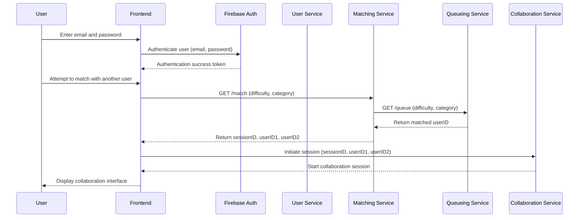

```mermaid
sequenceDiagram
    participant User
    participant Frontend
    participant Firebase Auth
    participant User Service
    participant Matching Service
    participant Queueing Service
    participant Collaboration Service

    User->>Frontend: Enter email and password
    Frontend->>Firebase Auth: Authenticate user (email, password)
    Firebase Auth-->>Frontend: Authentication success token

    User->>Frontend: Attempt to match with another user
    Frontend->>Matching Service: GET /match (difficulty, category)
    Matching Service->>Queueing Service: GET /queue (difficulty, category)
    Queueing Service-->>Matching Service: Return matched userID
    Matching Service-->>Frontend: Return sessionID, userID1, userID2

    Frontend->>Collaboration Service: Initiate session (sessionID, userID1, userID2)
    Collaboration Service-->>Frontend: Start collaboration session
    Frontend-->>User: Display collaboration interface

```