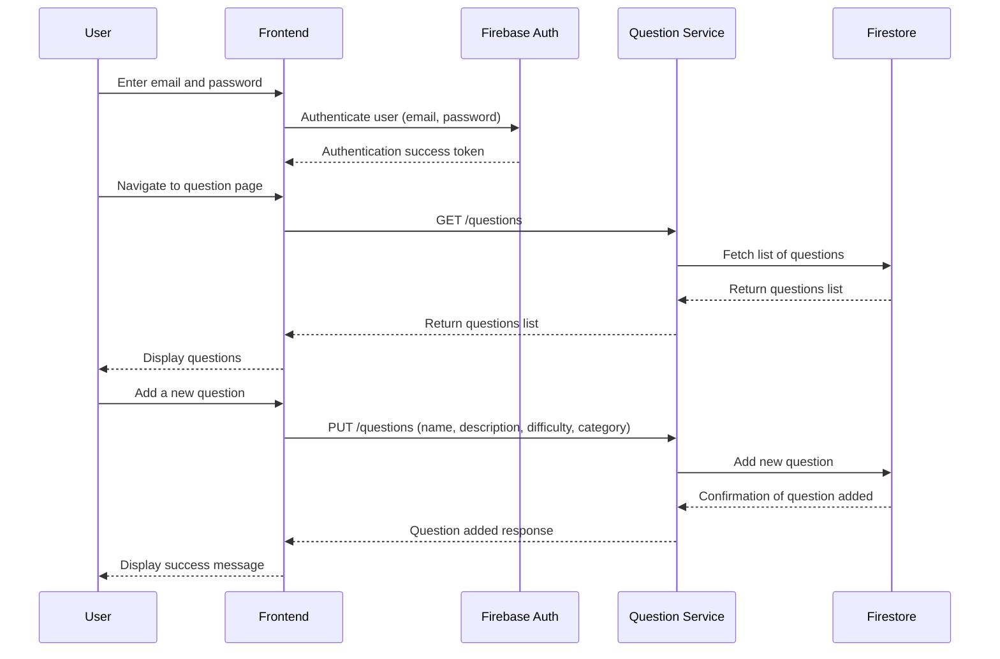

```mermaid
sequenceDiagram
    participant User
    participant Frontend
    participant Firebase Auth
    participant Question Service
    participant Firestore

    User->>Frontend: Enter email and password
    Frontend->>Firebase Auth: Authenticate user (email, password)
    Firebase Auth-->>Frontend: Authentication success token

    User->>Frontend: Navigate to question page
    Frontend->>Question Service: GET /questions
    Question Service->>Firestore: Fetch list of questions
    Firestore-->>Question Service: Return questions list
    Question Service-->>Frontend: Return questions list
    Frontend-->>User: Display questions

    User->>Frontend: Add a new question
    Frontend->>Question Service: PUT /questions (name, description, difficulty, category)
    Question Service->>Firestore: Add new question
    Firestore-->>Question Service: Confirmation of question added
    Question Service-->>Frontend: Question added response
    Frontend-->>User: Display success message

```